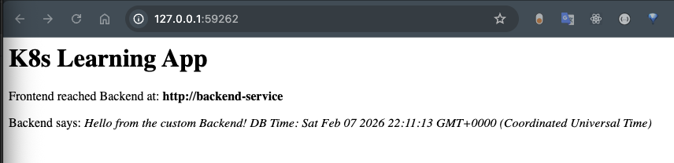

# A guide on How to set up and use K8S with Helm charts
The guide below is a quick-crash-course in learning how to set up your own K8S Cluster locally on your Docker
and Deploying your apps on it using Helm.
- The apps simulated in this quick learning guide are a PG DB, BE service & a FE/BFF

## Step 1 - Infra setup
1. installing minikube with: `brew install minikube`
2. ensure docker is running on the machine, and set minikube to use docker as its driver: `minikube config set driver docker`
3. the last command makes k8s run inside a container in docker. then start it with: `minikube start` 
4. now that minikube started, we use kubectl to talk to our cluster - run `kubectl get nodes` 
5. run `kubectl config get-contexts` to ensure that our kubectl is talking to the minikube cluster we installed (check where * is pointing at) 

## Step 2 - installing DB 
1. setting up a secret
2. setting a PVC (claiming space on HDD that survives in case of pod crashing/restarting)
3. setting up StatefulSet to run the PGDB container and link it to the PVC

### Secret
1. create the secret with kubectl: `kubectl create secret generic db-secret --from-literal=username=admin --from-literal=password=SuperSecret123`
2. creating PVC with: `kubectl get pvc` to check if there is anything
3. create 1GB file for disk space by creating a new file called `postgres-pvc.yaml` 
4. run the command `kubectl apply -f postgres-pvc.yaml` 
5. run `kubectl get pvc` to make sure it was created

### StatefulSet
this is the actual controller that will run the PGSQL container, fetch the pswd from the secret and plug in the storage from the PVC
- a controller is a background process watching the cluster state making changes to ensure actual state matches desired state
1. creae a file called `postgres-statefulset.yaml`
2. apply the statefulset config with: `kubectl apply -f postgres-statefulset.yaml`
- this tells kubernetes to use posgres:16 image from docker hub (default settings), look in db-secret to set the env vars for the DB, mount the posgres-pvc storage to the exact folder where PG stores its data /var/lib/posgresql/data 
3. lets apply the statefulset config, and run: `kubectl apply -f posgres-statefulset.yaml` 
4. watch the progress with: `kubectl get pods -w`  (should see its READY and STATUS change)
5. verify the connecting to the DB by running `kubectl exec postgres-0 -- env | grep POSTGRES` 
6. congrats you now have a running Posgres DB in your K8S cluster!

### The DB Service
1. create a file called `postgres-service.yaml`
2. apply the config with: `kubectl apply -f postgres-service.yaml` 
3. congrats now you have a postgres service that talks to the DB other Services can connect to
4. you can see it by running: `kubectl get services` (postgres-service should be listed)


## Step 3 - the BE
this is where our application code lives. most importantly we need our BE in K8S know how to talk to our DB serice.
we use service name in order to do that (postgres-service)
we'll thus configure a BE service deployment config.

1. create a file named: `backend-deployment.yaml` 
2. apply the BE deployment: `kubectl apply -f backend-deployment.yaml` 
3. make sure the pod is up (kubectl get pods)
4. once READY you should check if the BE service can reach the DB, run: `kubectl exec <your-backend-pod-name> -- curl -v postgres-service:5432`
5. if postgres answers then everything is working right :)


## Step 4 - the FE
this is very similar to the BE part
a. we create a deployment file for the fe
b. we create a service file for the fe

the service file for the fe though is a bit special. as it has a "type: NodePort" (defined under the spec section) and in addition we define a "nodePort: 30001" to make it externally accessible from outside the cluster.

run: `minikube service fe-service --url` # this gets an accessible URL for the FE

the port might be different if you're running inside a docker container! so its accessible now INSIDE the docker network.
in order to resolve that, minikube opens an SSH tunnel with a random available port on the HOST (mac) and tunnels it to nodePort (30001)
thats why the terminal must stay open so it doesn't collapse the SSH tunnel by minikube

ALTERNATIVELY - you can do portforwarding: `kubectl port-forward svc/fe-service 8080:80` and access the fe on `localhost:8080`


## Step 5 - HELM Charts
Helm is like a package manager for K8S, similar to what NPM is for Node or pip for Python. 

The problem: solving is the "YAML Fatigue"
- we keep writing static YAML files, which is fine for one person on a laptop or for a very very small project.
- But as the project grows:
    1. Hardcoded values: if you wanna change PG DB password, you need to find and replace it in the Secret, the StatefulSet and the BE Deployment.
    2. If you want to create a "Testing" and "Prod" versions of the app, the files would need to be duplicated.
    3. No versioning. If you update the backend and it crashes, kubectl doesnt have an easy undo to roll back to a prev working version.

The solution: Charts and Templates
Helm solves those problems by turning those YAML files into Templates!
so hardcoded values like:
    "postgres-service" turn into -> {{ .Values.dbName }}

All those specific settings are kept in a single file called `values.yaml`

when you "install" the chart, Helm combines the templates with the values to create the final manifest.

*A Helm chart* is essentially a folder that includes the combination of the Templates with the Values and some metadata.

To rampup a skeleton of the first Helm chart, run:
> `brew install helm`
> `helm create my-app-stack`

This creates a skeleton Helm chart.

1. We will delete all files in the `templates` directory except the NOTES.txt and `_helpers.tpl`
2. We'll move our YAML files into the `templates` dir
3. We now have a VALID Helm project, even though its not leveraging the templates and values
4. Dry-run check with: `helm install my-test-release ./my-app-stack --dry-run` - you should see all the yaml files with their values

**Real deployment**
After doing more tweaks on the `values.yaml` file, and in order to deploy the application with Helm we run a cleanup first:
```bash
kubectl delete pvc postgres-pvc
kubectl delete statefulset postgres
kubectl delete deployment backend frontend
kubectl delete svc postgres-service backend-service fe-service 
```

and after that, run the Helm install command:
```bash
helm install k8s-learning-app ./my-app-stack
```
parameters:
1. the 1st parameter is the name of the release
2. the 2nd parameter is the name of the helm chart

The install `STATUS` should be set to `deployed`

then you can re-run the port-forwrading for accessing the FE:
```bash
kubectl port-forward svc/fe-service 8080:80
```

### Valdidation
1. lets make sure everything is running as we expect it to (pods, services & stateset):
```bash
kubectl get all
```
2. lets check that the FE can reach the BE service with:
```bash
kubectl exec <frontend-pod-name> -- curl -I http://backend-service
```

### Upgrading a chart
after making changes to the config files (yaml), you can run:
```bash
helm upgrade k8s-learning-app ./my-app-stack
```
- it should create a new revision for the app


## Step 6 - Apps
under /apps you can find 2 custom applications:
1. backend - a backend app/service
2. bff - the backend for frontend (fe) service

they're both containerized apps that should be built using the
`build_docker_image.sh` files.
however, in order to make sure that the docker images are stored locally
for minikube you should run the `init_shell_for_minikube.sh`
- verify the images are built as expected running `docker images`

once you see them there, you can run helm upgrade to deploy the
apps and apply recent K8S and app changes to the cluster.
`helm upgrade k8s-learning-app ./my-app-stack`

››
After you're done deploying with helm (helm upgrade ...)
you can run port-forward command to the fe or simply just let
minikube do it automatically for you with:
```bash
minikube service fe-service
```

What you should expect to see later in the browser


### links
Gemini converation: https://gemini.google.com/app/6d9520626a6818c5

